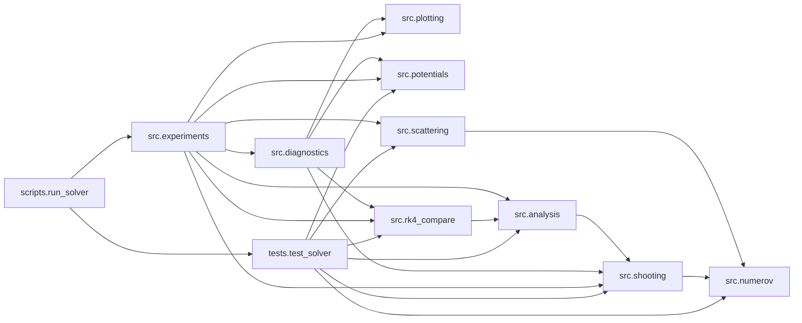
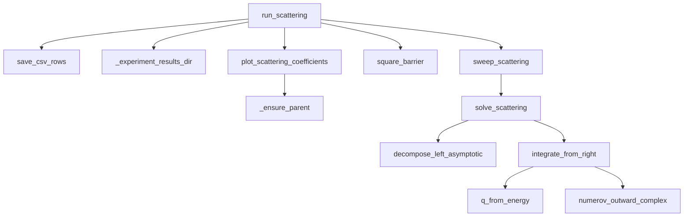

# Code Map

Generated from AST analysis of the local Python files in `src/`, `scripts/`, and `tests/`.

- Functions mapped: `104`
- Direct project-call edges: `201`
- Scope: direct calls only; indirect calls through function arguments such as `potential_fn(...)` are not inferred.
- Regenerate with: `python3 scripts/generate_code_map.py`
- Rendered diagrams:
- [Module flow SVG](/Users/alon/Projects/Numerov-bound-states/docs/code_map/code_map_modules.svg:1)
- [Core solver SVG](/Users/alon/Projects/Numerov-bound-states/docs/code_map/code_map_core.svg:1)
- [Experiments and tests SVG](/Users/alon/Projects/Numerov-bound-states/docs/code_map/code_map_experiments.svg:1)

## Potential-Specific Maps

### Infinite Square Well Experiment

- [DOT](/Users/alon/Projects/Numerov-bound-states/docs/code_map/code_map_infinite_square_well.dot:1)
- [SVG](/Users/alon/Projects/Numerov-bound-states/docs/code_map/code_map_infinite_square_well.svg:1)

### Harmonic Oscillator Experiment

- [DOT](/Users/alon/Projects/Numerov-bound-states/docs/code_map/code_map_harmonic_oscillator.dot:1)
- [SVG](/Users/alon/Projects/Numerov-bound-states/docs/code_map/code_map_harmonic_oscillator.svg:1)

### Quartic Double-Well Experiment

- [DOT](/Users/alon/Projects/Numerov-bound-states/docs/code_map/code_map_quartic_double_well.dot:1)
- [SVG](/Users/alon/Projects/Numerov-bound-states/docs/code_map/code_map_quartic_double_well.svg:1)

### Finite Square Well Experiment

- [DOT](/Users/alon/Projects/Numerov-bound-states/docs/code_map/code_map_finite_square_well.dot:1)
- [SVG](/Users/alon/Projects/Numerov-bound-states/docs/code_map/code_map_finite_square_well.svg:1)

### Single Square-Barrier Scattering Experiment

- [DOT](/Users/alon/Projects/Numerov-bound-states/docs/code_map/code_map_single_square_barrier.dot:1)
- [SVG](/Users/alon/Projects/Numerov-bound-states/docs/code_map/code_map_single_square_barrier.svg:1)

### Double Square-Barrier Scattering Experiment

- [DOT](/Users/alon/Projects/Numerov-bound-states/docs/code_map/code_map_double_square_barrier.dot:1)
- [SVG](/Users/alon/Projects/Numerov-bound-states/docs/code_map/code_map_double_square_barrier.svg:1)

## Module-Level Flow

## Bound-State and Scattering Core

```mermaid
flowchart TD
    src_numerov_derivative_at_right_edge[derivative_at_right_edge]
    src_numerov_normalize_wavefunction[normalize_wavefunction]
    src_numerov_numerov_march[numerov_march]
    src_numerov_q_from_energy[q_from_energy]
    src_rk4_compare_RK4_bisect_energy[RK4_bisect_energy]
    src_rk4_compare_RK4_bisect_energy --> src_rk4_compare_RK4_inward_mismatch[RK4_inward_mismatch]
    src_rk4_compare_RK4_bisection_history[RK4_bisection_history]
    src_rk4_compare_RK4_bisection_history --> src_rk4_compare_RK4_diagnostic_mismatch[RK4_diagnostic_mismatch]
    src_rk4_compare_RK4_bisection_history --> src_rk4_compare_RK4_inward_mismatch[RK4_inward_mismatch]
    src_rk4_compare_RK4_diagnostic_mismatch[RK4_diagnostic_mismatch]
    src_rk4_compare_RK4_diagnostic_mismatch --> src_rk4_compare_RK4_step[RK4_step]
    src_rk4_compare_RK4_find_brackets[RK4_find_brackets]
    src_rk4_compare_RK4_find_brackets --> src_rk4_compare_RK4_inward_mismatch[RK4_inward_mismatch]
    src_rk4_compare_RK4_harmonic_convergence_vs_box_size_fixed_spacing[RK4_harmonic_convergence_vs_box_size_fixed_spacing]
    src_rk4_compare_RK4_harmonic_convergence_vs_box_size_fixed_spacing --> src_rk4_compare_RK4_solve_harmonic_oscillator_energies[RK4_solve_harmonic_oscillator_energies]
    src_rk4_compare_RK4_harmonic_convergence_vs_grid[RK4_harmonic_convergence_vs_grid]
    src_rk4_compare_RK4_harmonic_convergence_vs_grid --> src_rk4_compare_RK4_solve_harmonic_oscillator_energies[RK4_solve_harmonic_oscillator_energies]
    src_rk4_compare_RK4_inward_mismatch[RK4_inward_mismatch]
    src_rk4_compare_RK4_inward_mismatch --> src_rk4_compare_RK4_step[RK4_step]
    src_rk4_compare_RK4_sample_mismatch[RK4_sample_mismatch]
    src_rk4_compare_RK4_sample_mismatch --> src_rk4_compare_RK4_diagnostic_mismatch[RK4_diagnostic_mismatch]
    src_rk4_compare_RK4_sample_mismatch --> src_rk4_compare_RK4_inward_mismatch[RK4_inward_mismatch]
    src_rk4_compare_RK4_solve_harmonic_oscillator_energies[RK4_solve_harmonic_oscillator_energies]
    src_rk4_compare_RK4_solve_harmonic_oscillator_energies --> src_rk4_compare_RK4_bisect_energy[RK4_bisect_energy]
    src_rk4_compare_RK4_solve_harmonic_oscillator_energies --> src_rk4_compare_RK4_find_brackets[RK4_find_brackets]
    src_rk4_compare_RK4_step[RK4_step]
    src_rk4_compare_RK4_step --> src_rk4_compare__harmonic_rhs[_harmonic_rhs]
    src_rk4_compare__harmonic_rhs[_harmonic_rhs]
    src_scattering_decompose_left_asymptotic[decompose_left_asymptotic]
    src_scattering_find_transmission_peaks[find_transmission_peaks]
    src_scattering_integrate_from_right[integrate_from_right]
    src_scattering_integrate_from_right --> src_numerov_q_from_energy[q_from_energy]
    src_scattering_integrate_from_right --> src_scattering_numerov_outward_complex[numerov_outward_complex]
    src_scattering_numerov_outward_complex[numerov_outward_complex]
    src_scattering_scattering_wavefunction[scattering_wavefunction]
    src_scattering_scattering_wavefunction --> src_scattering_integrate_from_right[integrate_from_right]
    src_scattering_scattering_wavefunction --> src_scattering_solve_scattering[solve_scattering]
    src_scattering_solve_scattering[solve_scattering]
    src_scattering_solve_scattering --> src_scattering_decompose_left_asymptotic[decompose_left_asymptotic]
    src_scattering_solve_scattering --> src_scattering_integrate_from_right[integrate_from_right]
    src_scattering_sweep_scattering[sweep_scattering]
    src_scattering_sweep_scattering --> src_scattering_solve_scattering[solve_scattering]
    src_shooting_bisect_energy_inward_shooting[bisect_energy_inward_shooting]
    src_shooting_bisect_energy_inward_shooting --> src_shooting_boundary_mismatch_inward_shooting[boundary_mismatch_inward_shooting]
    src_shooting_bisect_energy_outward_shooting[bisect_energy_outward_shooting]
    src_shooting_bisect_energy_outward_shooting --> src_shooting_boundary_mismatch_outward_shooting[boundary_mismatch_outward_shooting]
    src_shooting_bisection_history_inward_shooting[bisection_history_inward_shooting]
    src_shooting_bisection_history_inward_shooting --> src_shooting_boundary_mismatch_inward_shooting[boundary_mismatch_inward_shooting]
    src_shooting_bisection_history_inward_shooting --> src_shooting_diagnostic_mismatch_inward_shooting[diagnostic_mismatch_inward_shooting]
    src_shooting_bisection_history_outward_shooting[bisection_history_outward_shooting]
    src_shooting_bisection_history_outward_shooting --> src_shooting_boundary_mismatch_outward_shooting[boundary_mismatch_outward_shooting]
    src_shooting_bisection_history_outward_shooting --> src_shooting_diagnostic_mismatch_outward_shooting[diagnostic_mismatch_outward_shooting]
    src_shooting_boundary_mismatch_inward_shooting[boundary_mismatch_inward_shooting]
    src_shooting_boundary_mismatch_inward_shooting --> src_numerov_derivative_at_right_edge[derivative_at_right_edge]
    src_shooting_boundary_mismatch_inward_shooting --> src_shooting_half_domain_wavefunction_inward_shooting[half_domain_wavefunction_inward_shooting]
    src_shooting_boundary_mismatch_outward_shooting[boundary_mismatch_outward_shooting]
    src_shooting_boundary_mismatch_outward_shooting --> src_numerov_derivative_at_right_edge[derivative_at_right_edge]
    src_shooting_boundary_mismatch_outward_shooting --> src_shooting_half_domain_wavefunction_outward_shooting[half_domain_wavefunction_outward_shooting]
    src_shooting_build_full_wavefunction[build_full_wavefunction]
    src_shooting_diagnostic_mismatch_inward_shooting[diagnostic_mismatch_inward_shooting]
    src_shooting_diagnostic_mismatch_inward_shooting --> src_numerov_derivative_at_right_edge[derivative_at_right_edge]
    src_shooting_diagnostic_mismatch_inward_shooting --> src_shooting_half_domain_wavefunction_inward_shooting[half_domain_wavefunction_inward_shooting]
    src_shooting_diagnostic_mismatch_outward_shooting[diagnostic_mismatch_outward_shooting]
    src_shooting_diagnostic_mismatch_outward_shooting --> src_shooting_half_domain_wavefunction_outward_shooting[half_domain_wavefunction_outward_shooting]
    src_shooting_find_brackets_inward_shooting[find_brackets_inward_shooting]
    src_shooting_find_brackets_inward_shooting --> src_shooting_sample_mismatch_inward_shooting[sample_mismatch_inward_shooting]
    src_shooting_find_brackets_outward_shooting[find_brackets_outward_shooting]
    src_shooting_find_brackets_outward_shooting --> src_shooting_boundary_mismatch_outward_shooting[boundary_mismatch_outward_shooting]
    src_shooting_half_domain_wavefunction_inward_shooting[half_domain_wavefunction_inward_shooting]
    src_shooting_half_domain_wavefunction_inward_shooting --> src_numerov_numerov_march[numerov_march]
    src_shooting_half_domain_wavefunction_inward_shooting --> src_numerov_q_from_energy[q_from_energy]
    src_shooting_half_domain_wavefunction_inward_shooting --> src_shooting_initial_conditions_inward_shooting[initial_conditions_inward_shooting]
    src_shooting_half_domain_wavefunction_outward_shooting[half_domain_wavefunction_outward_shooting]
    src_shooting_half_domain_wavefunction_outward_shooting --> src_numerov_numerov_march[numerov_march]
    src_shooting_half_domain_wavefunction_outward_shooting --> src_numerov_q_from_energy[q_from_energy]
    src_shooting_half_domain_wavefunction_outward_shooting --> src_shooting_initial_conditions_outward_shooting[initial_conditions_outward_shooting]
    src_shooting_initial_conditions_inward_shooting[initial_conditions_inward_shooting]
    src_shooting_initial_conditions_outward_shooting[initial_conditions_outward_shooting]
    src_shooting_sample_boundary_mismatch_outward_shooting[sample_boundary_mismatch_outward_shooting]
    src_shooting_sample_boundary_mismatch_outward_shooting --> src_shooting_boundary_mismatch_outward_shooting[boundary_mismatch_outward_shooting]
    src_shooting_sample_boundary_mismatch_outward_shooting --> src_shooting_diagnostic_mismatch_outward_shooting[diagnostic_mismatch_outward_shooting]
    src_shooting_sample_mismatch_inward_shooting[sample_mismatch_inward_shooting]
    src_shooting_sample_mismatch_inward_shooting --> src_shooting_boundary_mismatch_inward_shooting[boundary_mismatch_inward_shooting]
    src_shooting_sample_mismatch_inward_shooting --> src_shooting_diagnostic_mismatch_inward_shooting[diagnostic_mismatch_inward_shooting]
    src_shooting_solve_state_from_bracket_inward_shooting[solve_state_from_bracket_inward_shooting]
    src_shooting_solve_state_from_bracket_inward_shooting --> src_numerov_normalize_wavefunction[normalize_wavefunction]
    src_shooting_solve_state_from_bracket_inward_shooting --> src_shooting_bisect_energy_inward_shooting[bisect_energy_inward_shooting]
    src_shooting_solve_state_from_bracket_inward_shooting --> src_shooting_build_full_wavefunction[build_full_wavefunction]
    src_shooting_solve_state_from_bracket_inward_shooting --> src_shooting_half_domain_wavefunction_inward_shooting[half_domain_wavefunction_inward_shooting]
    src_shooting_solve_state_from_bracket_outward_shooting[solve_state_from_bracket_outward_shooting]
    src_shooting_solve_state_from_bracket_outward_shooting --> src_numerov_normalize_wavefunction[normalize_wavefunction]
    src_shooting_solve_state_from_bracket_outward_shooting --> src_shooting_bisect_energy_outward_shooting[bisect_energy_outward_shooting]
    src_shooting_solve_state_from_bracket_outward_shooting --> src_shooting_build_full_wavefunction[build_full_wavefunction]
    src_shooting_solve_state_from_bracket_outward_shooting --> src_shooting_half_domain_wavefunction_outward_shooting[half_domain_wavefunction_outward_shooting]
    src_shooting_solve_symmetric_potential_inward_shooting[solve_symmetric_potential_inward_shooting]
    src_shooting_solve_symmetric_potential_inward_shooting --> src_shooting_find_brackets_inward_shooting[find_brackets_inward_shooting]
    src_shooting_solve_symmetric_potential_inward_shooting --> src_shooting_solve_state_from_bracket_inward_shooting[solve_state_from_bracket_inward_shooting]
    src_shooting_solve_symmetric_potential_outward_shooting[solve_symmetric_potential_outward_shooting]
    src_shooting_solve_symmetric_potential_outward_shooting --> src_shooting_find_brackets_outward_shooting[find_brackets_outward_shooting]
    src_shooting_solve_symmetric_potential_outward_shooting --> src_shooting_solve_state_from_bracket_outward_shooting[solve_state_from_bracket_outward_shooting]
```

## Experiments and Entry Points

```mermaid
flowchart TD
    scripts_run_solver_main[main]
    scripts_run_solver_main --> src_experiments_run_quartic_double_well[run_quartic_double_well]
    scripts_run_solver_main --> tests_test_solver_run_all_tests[run_all_tests]
    src_analysis_convergence_vs_box_size_fixed_spacing[convergence_vs_box_size_fixed_spacing]
    src_analysis_convergence_vs_box_size_fixed_spacing --> src_analysis_energies_from_states[energies_from_states]
    src_analysis_convergence_vs_grid[convergence_vs_grid]
    src_analysis_convergence_vs_grid --> src_analysis_energies_from_states[energies_from_states]
    src_analysis_convergence_vs_grid_successive[convergence_vs_grid_successive]
    src_analysis_convergence_vs_grid_successive --> src_analysis_energies_from_states[energies_from_states]
    src_analysis_energies_from_states[energies_from_states]
    src_analysis_estimate_convergence_slopes[estimate_convergence_slopes]
    src_analysis_exact_harmonic_oscillator_energies[exact_harmonic_oscillator_energies]
    src_analysis_exact_square_well_energies[exact_square_well_energies]
    src_analysis_save_csv_rows[save_csv_rows]
    src_analysis_splitting_vs_parameter[splitting_vs_parameter]
    src_experiments__experiment_results_dir[_experiment_results_dir]
    src_experiments_run_finite_square_well[run_finite_square_well]
    src_experiments_run_finite_square_well --> src_analysis_save_csv_rows[save_csv_rows]
    src_experiments_run_finite_square_well --> src_experiments__experiment_results_dir[_experiment_results_dir]
    src_experiments_run_finite_square_well --> src_plotting_plot_potential_and_states[plot_potential_and_states]
    src_experiments_run_finite_square_well --> src_plotting_plot_probability_densities[plot_probability_densities]
    src_experiments_run_harmonic_oscillator[run_harmonic_oscillator]
    src_experiments_run_harmonic_oscillator --> src_analysis_convergence_vs_box_size_fixed_spacing[convergence_vs_box_size_fixed_spacing]
    src_experiments_run_harmonic_oscillator --> src_analysis_convergence_vs_grid[convergence_vs_grid]
    src_experiments_run_harmonic_oscillator --> src_analysis_estimate_convergence_slopes[estimate_convergence_slopes]
    src_experiments_run_harmonic_oscillator --> src_analysis_exact_harmonic_oscillator_energies[exact_harmonic_oscillator_energies]
    src_experiments_run_harmonic_oscillator --> src_analysis_save_csv_rows[save_csv_rows]
    src_experiments_run_harmonic_oscillator --> src_experiments__experiment_results_dir[_experiment_results_dir]
    src_experiments_run_harmonic_oscillator --> src_experiments_run_harmonic_oscillator_RK4_comparison[run_harmonic_oscillator_RK4_comparison]
    src_experiments_run_harmonic_oscillator --> src_plotting_plot_energy_comparison[plot_energy_comparison]
    src_experiments_run_harmonic_oscillator --> src_plotting_plot_error_curve[plot_error_curve]
    src_experiments_run_harmonic_oscillator --> src_plotting_plot_potential_and_states[plot_potential_and_states]
    src_experiments_run_harmonic_oscillator --> src_plotting_plot_probability_densities[plot_probability_densities]
    src_experiments_run_harmonic_oscillator_RK4_comparison[run_harmonic_oscillator_RK4_comparison]
    src_experiments_run_harmonic_oscillator_RK4_comparison --> src_analysis_estimate_convergence_slopes[estimate_convergence_slopes]
    src_experiments_run_harmonic_oscillator_RK4_comparison --> src_analysis_save_csv_rows[save_csv_rows]
    src_experiments_run_harmonic_oscillator_RK4_comparison --> src_plotting_plot_energy_comparison[plot_energy_comparison]
    src_experiments_run_harmonic_oscillator_RK4_comparison --> src_plotting_plot_error_curve[plot_error_curve]
    src_experiments_run_harmonic_oscillator_RK4_comparison --> src_plotting_plot_numerov_vs_RK4_errors[plot_numerov_vs_RK4_errors]
    src_experiments_run_quartic_double_well[run_quartic_double_well]
    src_experiments_run_quartic_double_well --> src_analysis_convergence_vs_box_size_fixed_spacing[convergence_vs_box_size_fixed_spacing]
    src_experiments_run_quartic_double_well --> src_analysis_convergence_vs_grid_successive[convergence_vs_grid_successive]
    src_experiments_run_quartic_double_well --> src_analysis_estimate_convergence_slopes[estimate_convergence_slopes]
    src_experiments_run_quartic_double_well --> src_analysis_save_csv_rows[save_csv_rows]
    src_experiments_run_quartic_double_well --> src_analysis_splitting_vs_parameter[splitting_vs_parameter]
    src_experiments_run_quartic_double_well --> src_experiments__experiment_results_dir[_experiment_results_dir]
    src_experiments_run_quartic_double_well --> src_plotting_plot_error_curve[plot_error_curve]
    src_experiments_run_quartic_double_well --> src_plotting_plot_potential_and_states[plot_potential_and_states]
    src_experiments_run_quartic_double_well --> src_plotting_plot_probability_densities[plot_probability_densities]
    src_experiments_run_quartic_double_well --> src_plotting_plot_splitting_curve[plot_splitting_curve]
    src_experiments_run_scattering[run_scattering]
    src_experiments_run_scattering --> src_analysis_save_csv_rows[save_csv_rows]
    src_experiments_run_scattering --> src_experiments__experiment_results_dir[_experiment_results_dir]
    src_experiments_run_scattering --> src_plotting_plot_scattering_coefficients[plot_scattering_coefficients]
    src_experiments_run_scattering --> src_plotting_plot_scattering_potential_and_probability[plot_scattering_potential_and_probability]
    src_experiments_run_square_well[run_square_well]
    src_experiments_run_square_well --> src_analysis_convergence_vs_grid[convergence_vs_grid]
    src_experiments_run_square_well --> src_analysis_estimate_convergence_slopes[estimate_convergence_slopes]
    src_experiments_run_square_well --> src_analysis_exact_square_well_energies[exact_square_well_energies]
    src_experiments_run_square_well --> src_analysis_save_csv_rows[save_csv_rows]
    src_experiments_run_square_well --> src_experiments__experiment_results_dir[_experiment_results_dir]
    src_experiments_run_square_well --> src_plotting_plot_energy_comparison[plot_energy_comparison]
    src_experiments_run_square_well --> src_plotting_plot_error_curve[plot_error_curve]
    src_experiments_run_square_well --> src_plotting_plot_potential_and_states[plot_potential_and_states]
    src_experiments_run_square_well --> src_plotting_plot_probability_densities[plot_probability_densities]
    src_plotting__ensure_parent[_ensure_parent]
    src_plotting__symlog_linthresh[_symlog_linthresh]
    src_plotting_plot_energy_comparison[plot_energy_comparison]
    src_plotting_plot_energy_comparison --> src_plotting__ensure_parent[_ensure_parent]
    src_plotting_plot_error_curve[plot_error_curve]
    src_plotting_plot_error_curve --> src_plotting__ensure_parent[_ensure_parent]
    src_plotting_plot_numerov_vs_RK4_errors[plot_numerov_vs_RK4_errors]
    src_plotting_plot_numerov_vs_RK4_errors --> src_plotting__ensure_parent[_ensure_parent]
    src_plotting_plot_potential_and_states[plot_potential_and_states]
    src_plotting_plot_potential_and_states --> src_plotting__ensure_parent[_ensure_parent]
    src_plotting_plot_probability_densities[plot_probability_densities]
    src_plotting_plot_probability_densities --> src_plotting__ensure_parent[_ensure_parent]
    src_plotting_plot_root_finding_diagnostic[plot_root_finding_diagnostic]
    src_plotting_plot_root_finding_diagnostic --> src_plotting__ensure_parent[_ensure_parent]
    src_plotting_plot_root_finding_diagnostic --> src_plotting__symlog_linthresh[_symlog_linthresh]
    src_plotting_plot_root_finding_zoom[plot_root_finding_zoom]
    src_plotting_plot_root_finding_zoom --> src_plotting__ensure_parent[_ensure_parent]
    src_plotting_plot_root_finding_zoom --> src_plotting__symlog_linthresh[_symlog_linthresh]
    src_plotting_plot_scattering_coefficients[plot_scattering_coefficients]
    src_plotting_plot_scattering_coefficients --> src_plotting__ensure_parent[_ensure_parent]
    src_plotting_plot_scattering_potential_and_probability[plot_scattering_potential_and_probability]
    src_plotting_plot_scattering_potential_and_probability --> src_plotting__ensure_parent[_ensure_parent]
    src_plotting_plot_splitting_curve[plot_splitting_curve]
    src_plotting_plot_splitting_curve --> src_plotting__ensure_parent[_ensure_parent]
    tests_test_solver_run_all_tests[run_all_tests]
    tests_test_solver_run_all_tests --> tests_test_solver_test_derivative_at_right_edge_polynomial[test_derivative_at_right_edge_polynomial]
    tests_test_solver_run_all_tests --> tests_test_solver_test_double_well_splitting_positive[test_double_well_splitting_positive]
    tests_test_solver_run_all_tests --> tests_test_solver_test_find_rk4_brackets_accepts_exact_zero_hit[test_find_rk4_brackets_accepts_exact_zero_hit]
    tests_test_solver_run_all_tests --> tests_test_solver_test_harmonic_oscillator_first_levels[test_harmonic_oscillator_first_levels]
    tests_test_solver_run_all_tests --> tests_test_solver_test_harmonic_oscillator_inward_shooting_first_levels[test_harmonic_oscillator_inward_shooting_first_levels]
    tests_test_solver_run_all_tests --> tests_test_solver_test_normalization[test_normalization]
    tests_test_solver_run_all_tests --> tests_test_solver_test_run_solver_import_without_experiment_dependencies[test_run_solver_import_without_experiment_dependencies]
    tests_test_solver_run_all_tests --> tests_test_solver_test_scattering_probability_conservation[test_scattering_probability_conservation]
    tests_test_solver_run_all_tests --> tests_test_solver_test_square_well_convergence_order[test_square_well_convergence_order]
    tests_test_solver_run_all_tests --> tests_test_solver_test_square_well_ground_state[test_square_well_ground_state]
    tests_test_solver_test_derivative_at_right_edge_polynomial[test_derivative_at_right_edge_polynomial]
    tests_test_solver_test_double_well_even_odd_mismatch_scans_differ[test_double_well_even_odd_mismatch_scans_differ]
    tests_test_solver_test_double_well_larger_box_improves_low_lying_energies[test_double_well_larger_box_improves_low_lying_energies]
    tests_test_solver_test_double_well_low_state_mismatches_are_polished[test_double_well_low_state_mismatches_are_polished]
    tests_test_solver_test_double_well_same_box_grid_errors_decrease[test_double_well_same_box_grid_errors_decrease]
    tests_test_solver_test_double_well_same_box_grid_errors_decrease --> src_analysis_convergence_vs_grid_successive[convergence_vs_grid_successive]
    tests_test_solver_test_double_well_splitting_positive[test_double_well_splitting_positive]
    tests_test_solver_test_double_well_successive_convergence_order[test_double_well_successive_convergence_order]
    tests_test_solver_test_double_well_successive_convergence_order --> src_analysis_convergence_vs_grid_successive[convergence_vs_grid_successive]
    tests_test_solver_test_double_well_successive_convergence_order --> src_analysis_estimate_convergence_slopes[estimate_convergence_slopes]
    tests_test_solver_test_find_rk4_brackets_accepts_exact_zero_hit[test_find_rk4_brackets_accepts_exact_zero_hit]
    tests_test_solver_test_harmonic_oscillator_first_levels[test_harmonic_oscillator_first_levels]
    tests_test_solver_test_harmonic_oscillator_first_levels --> src_analysis_exact_harmonic_oscillator_energies[exact_harmonic_oscillator_energies]
    tests_test_solver_test_harmonic_oscillator_inward_shooting_first_levels[test_harmonic_oscillator_inward_shooting_first_levels]
    tests_test_solver_test_harmonic_oscillator_inward_shooting_first_levels --> src_analysis_exact_harmonic_oscillator_energies[exact_harmonic_oscillator_energies]
    tests_test_solver_test_normalization[test_normalization]
    tests_test_solver_test_quartic_double_well_exact_shifted_minimum[test_quartic_double_well_exact_shifted_minimum]
    tests_test_solver_test_run_solver_import_without_experiment_dependencies[test_run_solver_import_without_experiment_dependencies]
    tests_test_solver_test_scattering_probability_conservation[test_scattering_probability_conservation]
    tests_test_solver_test_square_well_convergence_includes_four_requested_states[test_square_well_convergence_includes_four_requested_states]
    tests_test_solver_test_square_well_convergence_includes_four_requested_states --> src_analysis_convergence_vs_grid[convergence_vs_grid]
    tests_test_solver_test_square_well_convergence_includes_four_requested_states --> src_analysis_exact_square_well_energies[exact_square_well_energies]
    tests_test_solver_test_square_well_convergence_order[test_square_well_convergence_order]
    tests_test_solver_test_square_well_convergence_order --> src_analysis_convergence_vs_grid[convergence_vs_grid]
    tests_test_solver_test_square_well_convergence_order --> src_analysis_estimate_convergence_slopes[estimate_convergence_slopes]
    tests_test_solver_test_square_well_convergence_order --> src_analysis_exact_square_well_energies[exact_square_well_energies]
    tests_test_solver_test_square_well_ground_state[test_square_well_ground_state]
    tests_test_solver_test_square_well_ground_state --> src_analysis_exact_square_well_energies[exact_square_well_energies]
```

## Infinite Square Well Experiment

```mermaid
flowchart TD
    src_analysis_convergence_vs_grid[convergence_vs_grid]
    src_analysis_convergence_vs_grid --> src_analysis_energies_from_states[energies_from_states]
    src_analysis_energies_from_states[energies_from_states]
    src_analysis_estimate_convergence_slopes[estimate_convergence_slopes]
    src_analysis_exact_square_well_energies[exact_square_well_energies]
    src_analysis_save_csv_rows[save_csv_rows]
    src_diagnostics__diagnostic_label_slug[_diagnostic_label_slug]
    src_diagnostics__plot_outward_root_diagnostics[_plot_outward_root_diagnostics]
    src_diagnostics__plot_outward_root_diagnostics --> src_diagnostics__diagnostic_label_slug[_diagnostic_label_slug]
    src_diagnostics__plot_outward_root_diagnostics --> src_plotting_plot_root_finding_diagnostic[plot_root_finding_diagnostic]
    src_diagnostics__plot_outward_root_diagnostics --> src_plotting_plot_root_finding_zoom[plot_root_finding_zoom]
    src_diagnostics__plot_outward_root_diagnostics --> src_shooting_bisection_history_outward_shooting[bisection_history_outward_shooting]
    src_diagnostics__plot_outward_root_diagnostics --> src_shooting_find_brackets_outward_shooting[find_brackets_outward_shooting]
    src_diagnostics__plot_outward_root_diagnostics --> src_shooting_sample_boundary_mismatch_outward_shooting[sample_boundary_mismatch_outward_shooting]
    src_diagnostics_plot_infinite_well_root_diagnostics[plot_infinite_well_root_diagnostics]
    src_diagnostics_plot_infinite_well_root_diagnostics --> src_diagnostics__plot_outward_root_diagnostics[_plot_outward_root_diagnostics]
    src_diagnostics_plot_infinite_well_root_diagnostics --> src_potentials_infinite_square_well_numeric[infinite_square_well_numeric]
    src_experiments__experiment_results_dir[_experiment_results_dir]
    src_experiments_run_square_well[run_square_well]
    src_experiments_run_square_well --> src_analysis_convergence_vs_grid[convergence_vs_grid]
    src_experiments_run_square_well --> src_analysis_estimate_convergence_slopes[estimate_convergence_slopes]
    src_experiments_run_square_well --> src_analysis_exact_square_well_energies[exact_square_well_energies]
    src_experiments_run_square_well --> src_analysis_save_csv_rows[save_csv_rows]
    src_experiments_run_square_well --> src_diagnostics_plot_infinite_well_root_diagnostics[plot_infinite_well_root_diagnostics]
    src_experiments_run_square_well --> src_experiments__experiment_results_dir[_experiment_results_dir]
    src_experiments_run_square_well --> src_plotting_plot_energy_comparison[plot_energy_comparison]
    src_experiments_run_square_well --> src_plotting_plot_error_curve[plot_error_curve]
    src_experiments_run_square_well --> src_plotting_plot_potential_and_states[plot_potential_and_states]
    src_experiments_run_square_well --> src_plotting_plot_probability_densities[plot_probability_densities]
    src_experiments_run_square_well --> src_potentials_infinite_square_well_numeric[infinite_square_well_numeric]
    src_experiments_run_square_well --> src_shooting_solve_symmetric_potential_outward_shooting[solve_symmetric_potential_outward_shooting]
    src_numerov_derivative_at_right_edge[derivative_at_right_edge]
    src_numerov_normalize_wavefunction[normalize_wavefunction]
    src_numerov_numerov_march[numerov_march]
    src_numerov_q_from_energy[q_from_energy]
    src_plotting__ensure_parent[_ensure_parent]
    src_plotting__symlog_linthresh[_symlog_linthresh]
    src_plotting_plot_energy_comparison[plot_energy_comparison]
    src_plotting_plot_energy_comparison --> src_plotting__ensure_parent[_ensure_parent]
    src_plotting_plot_error_curve[plot_error_curve]
    src_plotting_plot_error_curve --> src_plotting__ensure_parent[_ensure_parent]
    src_plotting_plot_potential_and_states[plot_potential_and_states]
    src_plotting_plot_potential_and_states --> src_plotting__ensure_parent[_ensure_parent]
    src_plotting_plot_probability_densities[plot_probability_densities]
    src_plotting_plot_probability_densities --> src_plotting__ensure_parent[_ensure_parent]
    src_plotting_plot_root_finding_diagnostic[plot_root_finding_diagnostic]
    src_plotting_plot_root_finding_diagnostic --> src_plotting__ensure_parent[_ensure_parent]
    src_plotting_plot_root_finding_diagnostic --> src_plotting__symlog_linthresh[_symlog_linthresh]
    src_plotting_plot_root_finding_zoom[plot_root_finding_zoom]
    src_plotting_plot_root_finding_zoom --> src_plotting__ensure_parent[_ensure_parent]
    src_plotting_plot_root_finding_zoom --> src_plotting__symlog_linthresh[_symlog_linthresh]
    src_potentials_infinite_square_well_numeric[infinite_square_well_numeric]
    src_shooting_bisect_energy_outward_shooting[bisect_energy_outward_shooting]
    src_shooting_bisect_energy_outward_shooting --> src_shooting_boundary_mismatch_outward_shooting[boundary_mismatch_outward_shooting]
    src_shooting_bisection_history_outward_shooting[bisection_history_outward_shooting]
    src_shooting_bisection_history_outward_shooting --> src_shooting_boundary_mismatch_outward_shooting[boundary_mismatch_outward_shooting]
    src_shooting_bisection_history_outward_shooting --> src_shooting_diagnostic_mismatch_outward_shooting[diagnostic_mismatch_outward_shooting]
    src_shooting_boundary_mismatch_outward_shooting[boundary_mismatch_outward_shooting]
    src_shooting_boundary_mismatch_outward_shooting --> src_numerov_derivative_at_right_edge[derivative_at_right_edge]
    src_shooting_boundary_mismatch_outward_shooting --> src_shooting_half_domain_wavefunction_outward_shooting[half_domain_wavefunction_outward_shooting]
    src_shooting_build_full_wavefunction[build_full_wavefunction]
    src_shooting_diagnostic_mismatch_outward_shooting[diagnostic_mismatch_outward_shooting]
    src_shooting_diagnostic_mismatch_outward_shooting --> src_shooting_half_domain_wavefunction_outward_shooting[half_domain_wavefunction_outward_shooting]
    src_shooting_find_brackets_outward_shooting[find_brackets_outward_shooting]
    src_shooting_find_brackets_outward_shooting --> src_shooting_boundary_mismatch_outward_shooting[boundary_mismatch_outward_shooting]
    src_shooting_half_domain_wavefunction_outward_shooting[half_domain_wavefunction_outward_shooting]
    src_shooting_half_domain_wavefunction_outward_shooting --> src_numerov_numerov_march[numerov_march]
    src_shooting_half_domain_wavefunction_outward_shooting --> src_numerov_q_from_energy[q_from_energy]
    src_shooting_half_domain_wavefunction_outward_shooting --> src_shooting_initial_conditions_outward_shooting[initial_conditions_outward_shooting]
    src_shooting_initial_conditions_outward_shooting[initial_conditions_outward_shooting]
    src_shooting_sample_boundary_mismatch_outward_shooting[sample_boundary_mismatch_outward_shooting]
    src_shooting_sample_boundary_mismatch_outward_shooting --> src_shooting_boundary_mismatch_outward_shooting[boundary_mismatch_outward_shooting]
    src_shooting_sample_boundary_mismatch_outward_shooting --> src_shooting_diagnostic_mismatch_outward_shooting[diagnostic_mismatch_outward_shooting]
    src_shooting_solve_state_from_bracket_outward_shooting[solve_state_from_bracket_outward_shooting]
    src_shooting_solve_state_from_bracket_outward_shooting --> src_numerov_normalize_wavefunction[normalize_wavefunction]
    src_shooting_solve_state_from_bracket_outward_shooting --> src_shooting_bisect_energy_outward_shooting[bisect_energy_outward_shooting]
    src_shooting_solve_state_from_bracket_outward_shooting --> src_shooting_build_full_wavefunction[build_full_wavefunction]
    src_shooting_solve_state_from_bracket_outward_shooting --> src_shooting_half_domain_wavefunction_outward_shooting[half_domain_wavefunction_outward_shooting]
    src_shooting_solve_symmetric_potential_outward_shooting[solve_symmetric_potential_outward_shooting]
    src_shooting_solve_symmetric_potential_outward_shooting --> src_shooting_find_brackets_outward_shooting[find_brackets_outward_shooting]
    src_shooting_solve_symmetric_potential_outward_shooting --> src_shooting_solve_state_from_bracket_outward_shooting[solve_state_from_bracket_outward_shooting]
```

## Harmonic Oscillator Experiment

```mermaid
flowchart TD
    src_analysis_convergence_vs_box_size_fixed_spacing[convergence_vs_box_size_fixed_spacing]
    src_analysis_convergence_vs_box_size_fixed_spacing --> src_analysis_energies_from_states[energies_from_states]
    src_analysis_convergence_vs_grid[convergence_vs_grid]
    src_analysis_convergence_vs_grid --> src_analysis_energies_from_states[energies_from_states]
    src_analysis_energies_from_states[energies_from_states]
    src_analysis_estimate_convergence_slopes[estimate_convergence_slopes]
    src_analysis_exact_harmonic_oscillator_energies[exact_harmonic_oscillator_energies]
    src_analysis_save_csv_rows[save_csv_rows]
    src_diagnostics__diagnostic_label_slug[_diagnostic_label_slug]
    src_diagnostics__plot_inward_root_diagnostics[_plot_inward_root_diagnostics]
    src_diagnostics__plot_inward_root_diagnostics --> src_diagnostics__diagnostic_label_slug[_diagnostic_label_slug]
    src_diagnostics__plot_inward_root_diagnostics --> src_plotting_plot_root_finding_diagnostic[plot_root_finding_diagnostic]
    src_diagnostics__plot_inward_root_diagnostics --> src_plotting_plot_root_finding_zoom[plot_root_finding_zoom]
    src_diagnostics__plot_inward_root_diagnostics --> src_shooting_bisection_history_inward_shooting[bisection_history_inward_shooting]
    src_diagnostics__plot_inward_root_diagnostics --> src_shooting_find_brackets_inward_shooting[find_brackets_inward_shooting]
    src_diagnostics__plot_inward_root_diagnostics --> src_shooting_sample_mismatch_inward_shooting[sample_mismatch_inward_shooting]
    src_diagnostics_plot_harmonic_oscillator_RK4_root_diagnostics[plot_harmonic_oscillator_RK4_root_diagnostics]
    src_diagnostics_plot_harmonic_oscillator_RK4_root_diagnostics --> src_diagnostics__diagnostic_label_slug[_diagnostic_label_slug]
    src_diagnostics_plot_harmonic_oscillator_RK4_root_diagnostics --> src_plotting_plot_root_finding_diagnostic[plot_root_finding_diagnostic]
    src_diagnostics_plot_harmonic_oscillator_RK4_root_diagnostics --> src_plotting_plot_root_finding_zoom[plot_root_finding_zoom]
    src_diagnostics_plot_harmonic_oscillator_RK4_root_diagnostics --> src_rk4_compare_RK4_bisection_history[RK4_bisection_history]
    src_diagnostics_plot_harmonic_oscillator_RK4_root_diagnostics --> src_rk4_compare_RK4_find_brackets[RK4_find_brackets]
    src_diagnostics_plot_harmonic_oscillator_RK4_root_diagnostics --> src_rk4_compare_RK4_sample_mismatch[RK4_sample_mismatch]
    src_diagnostics_plot_harmonic_oscillator_root_diagnostics[plot_harmonic_oscillator_root_diagnostics]
    src_diagnostics_plot_harmonic_oscillator_root_diagnostics --> src_diagnostics__plot_inward_root_diagnostics[_plot_inward_root_diagnostics]
    src_experiments__experiment_results_dir[_experiment_results_dir]
    src_experiments_run_harmonic_oscillator[run_harmonic_oscillator]
    src_experiments_run_harmonic_oscillator --> src_analysis_convergence_vs_box_size_fixed_spacing[convergence_vs_box_size_fixed_spacing]
    src_experiments_run_harmonic_oscillator --> src_analysis_convergence_vs_grid[convergence_vs_grid]
    src_experiments_run_harmonic_oscillator --> src_analysis_estimate_convergence_slopes[estimate_convergence_slopes]
    src_experiments_run_harmonic_oscillator --> src_analysis_exact_harmonic_oscillator_energies[exact_harmonic_oscillator_energies]
    src_experiments_run_harmonic_oscillator --> src_analysis_save_csv_rows[save_csv_rows]
    src_experiments_run_harmonic_oscillator --> src_diagnostics_plot_harmonic_oscillator_root_diagnostics[plot_harmonic_oscillator_root_diagnostics]
    src_experiments_run_harmonic_oscillator --> src_experiments__experiment_results_dir[_experiment_results_dir]
    src_experiments_run_harmonic_oscillator --> src_experiments_run_harmonic_oscillator_RK4_comparison[run_harmonic_oscillator_RK4_comparison]
    src_experiments_run_harmonic_oscillator --> src_plotting_plot_energy_comparison[plot_energy_comparison]
    src_experiments_run_harmonic_oscillator --> src_plotting_plot_error_curve[plot_error_curve]
    src_experiments_run_harmonic_oscillator --> src_plotting_plot_potential_and_states[plot_potential_and_states]
    src_experiments_run_harmonic_oscillator --> src_plotting_plot_probability_densities[plot_probability_densities]
    src_experiments_run_harmonic_oscillator --> src_potentials_harmonic_oscillator[harmonic_oscillator]
    src_experiments_run_harmonic_oscillator --> src_shooting_solve_symmetric_potential_inward_shooting[solve_symmetric_potential_inward_shooting]
    src_experiments_run_harmonic_oscillator_RK4_comparison[run_harmonic_oscillator_RK4_comparison]
    src_experiments_run_harmonic_oscillator_RK4_comparison --> src_analysis_estimate_convergence_slopes[estimate_convergence_slopes]
    src_experiments_run_harmonic_oscillator_RK4_comparison --> src_analysis_save_csv_rows[save_csv_rows]
    src_experiments_run_harmonic_oscillator_RK4_comparison --> src_diagnostics_plot_harmonic_oscillator_RK4_root_diagnostics[plot_harmonic_oscillator_RK4_root_diagnostics]
    src_experiments_run_harmonic_oscillator_RK4_comparison --> src_plotting_plot_energy_comparison[plot_energy_comparison]
    src_experiments_run_harmonic_oscillator_RK4_comparison --> src_plotting_plot_error_curve[plot_error_curve]
    src_experiments_run_harmonic_oscillator_RK4_comparison --> src_plotting_plot_numerov_vs_RK4_errors[plot_numerov_vs_RK4_errors]
    src_experiments_run_harmonic_oscillator_RK4_comparison --> src_rk4_compare_RK4_harmonic_convergence_vs_box_size_fixed_spacing[RK4_harmonic_convergence_vs_box_size_fixed_spacing]
    src_experiments_run_harmonic_oscillator_RK4_comparison --> src_rk4_compare_RK4_harmonic_convergence_vs_grid[RK4_harmonic_convergence_vs_grid]
    src_experiments_run_harmonic_oscillator_RK4_comparison --> src_rk4_compare_RK4_solve_harmonic_oscillator_energies[RK4_solve_harmonic_oscillator_energies]
    src_numerov_derivative_at_right_edge[derivative_at_right_edge]
    src_numerov_normalize_wavefunction[normalize_wavefunction]
    src_numerov_numerov_march[numerov_march]
    src_numerov_q_from_energy[q_from_energy]
    src_plotting__ensure_parent[_ensure_parent]
    src_plotting__symlog_linthresh[_symlog_linthresh]
    src_plotting_plot_energy_comparison[plot_energy_comparison]
    src_plotting_plot_energy_comparison --> src_plotting__ensure_parent[_ensure_parent]
    src_plotting_plot_error_curve[plot_error_curve]
    src_plotting_plot_error_curve --> src_plotting__ensure_parent[_ensure_parent]
    src_plotting_plot_numerov_vs_RK4_errors[plot_numerov_vs_RK4_errors]
    src_plotting_plot_numerov_vs_RK4_errors --> src_plotting__ensure_parent[_ensure_parent]
    src_plotting_plot_potential_and_states[plot_potential_and_states]
    src_plotting_plot_potential_and_states --> src_plotting__ensure_parent[_ensure_parent]
    src_plotting_plot_probability_densities[plot_probability_densities]
    src_plotting_plot_probability_densities --> src_plotting__ensure_parent[_ensure_parent]
    src_plotting_plot_root_finding_diagnostic[plot_root_finding_diagnostic]
    src_plotting_plot_root_finding_diagnostic --> src_plotting__ensure_parent[_ensure_parent]
    src_plotting_plot_root_finding_diagnostic --> src_plotting__symlog_linthresh[_symlog_linthresh]
    src_plotting_plot_root_finding_zoom[plot_root_finding_zoom]
    src_plotting_plot_root_finding_zoom --> src_plotting__ensure_parent[_ensure_parent]
    src_plotting_plot_root_finding_zoom --> src_plotting__symlog_linthresh[_symlog_linthresh]
    src_potentials_harmonic_oscillator[harmonic_oscillator]
    src_rk4_compare_RK4_bisect_energy[RK4_bisect_energy]
    src_rk4_compare_RK4_bisect_energy --> src_rk4_compare_RK4_inward_mismatch[RK4_inward_mismatch]
    src_rk4_compare_RK4_bisection_history[RK4_bisection_history]
    src_rk4_compare_RK4_bisection_history --> src_rk4_compare_RK4_diagnostic_mismatch[RK4_diagnostic_mismatch]
    src_rk4_compare_RK4_bisection_history --> src_rk4_compare_RK4_inward_mismatch[RK4_inward_mismatch]
    src_rk4_compare_RK4_diagnostic_mismatch[RK4_diagnostic_mismatch]
    src_rk4_compare_RK4_diagnostic_mismatch --> src_rk4_compare_RK4_step[RK4_step]
    src_rk4_compare_RK4_find_brackets[RK4_find_brackets]
    src_rk4_compare_RK4_find_brackets --> src_rk4_compare_RK4_inward_mismatch[RK4_inward_mismatch]
    src_rk4_compare_RK4_harmonic_convergence_vs_box_size_fixed_spacing[RK4_harmonic_convergence_vs_box_size_fixed_spacing]
    src_rk4_compare_RK4_harmonic_convergence_vs_box_size_fixed_spacing --> src_analysis_exact_harmonic_oscillator_energies[exact_harmonic_oscillator_energies]
    src_rk4_compare_RK4_harmonic_convergence_vs_box_size_fixed_spacing --> src_rk4_compare_RK4_solve_harmonic_oscillator_energies[RK4_solve_harmonic_oscillator_energies]
    src_rk4_compare_RK4_harmonic_convergence_vs_grid[RK4_harmonic_convergence_vs_grid]
    src_rk4_compare_RK4_harmonic_convergence_vs_grid --> src_rk4_compare_RK4_solve_harmonic_oscillator_energies[RK4_solve_harmonic_oscillator_energies]
    src_rk4_compare_RK4_inward_mismatch[RK4_inward_mismatch]
    src_rk4_compare_RK4_inward_mismatch --> src_rk4_compare_RK4_step[RK4_step]
    src_rk4_compare_RK4_sample_mismatch[RK4_sample_mismatch]
    src_rk4_compare_RK4_sample_mismatch --> src_rk4_compare_RK4_diagnostic_mismatch[RK4_diagnostic_mismatch]
    src_rk4_compare_RK4_sample_mismatch --> src_rk4_compare_RK4_inward_mismatch[RK4_inward_mismatch]
    src_rk4_compare_RK4_solve_harmonic_oscillator_energies[RK4_solve_harmonic_oscillator_energies]
    src_rk4_compare_RK4_solve_harmonic_oscillator_energies --> src_analysis_exact_harmonic_oscillator_energies[exact_harmonic_oscillator_energies]
    src_rk4_compare_RK4_solve_harmonic_oscillator_energies --> src_rk4_compare_RK4_bisect_energy[RK4_bisect_energy]
    src_rk4_compare_RK4_solve_harmonic_oscillator_energies --> src_rk4_compare_RK4_find_brackets[RK4_find_brackets]
    src_rk4_compare_RK4_step[RK4_step]
    src_rk4_compare_RK4_step --> src_rk4_compare__harmonic_rhs[_harmonic_rhs]
    src_rk4_compare__harmonic_rhs[_harmonic_rhs]
    src_shooting_bisect_energy_inward_shooting[bisect_energy_inward_shooting]
    src_shooting_bisect_energy_inward_shooting --> src_shooting_boundary_mismatch_inward_shooting[boundary_mismatch_inward_shooting]
    src_shooting_bisection_history_inward_shooting[bisection_history_inward_shooting]
    src_shooting_bisection_history_inward_shooting --> src_shooting_boundary_mismatch_inward_shooting[boundary_mismatch_inward_shooting]
    src_shooting_bisection_history_inward_shooting --> src_shooting_diagnostic_mismatch_inward_shooting[diagnostic_mismatch_inward_shooting]
    src_shooting_boundary_mismatch_inward_shooting[boundary_mismatch_inward_shooting]
    src_shooting_boundary_mismatch_inward_shooting --> src_numerov_derivative_at_right_edge[derivative_at_right_edge]
    src_shooting_boundary_mismatch_inward_shooting --> src_shooting_half_domain_wavefunction_inward_shooting[half_domain_wavefunction_inward_shooting]
    src_shooting_build_full_wavefunction[build_full_wavefunction]
    src_shooting_diagnostic_mismatch_inward_shooting[diagnostic_mismatch_inward_shooting]
    src_shooting_diagnostic_mismatch_inward_shooting --> src_numerov_derivative_at_right_edge[derivative_at_right_edge]
    src_shooting_diagnostic_mismatch_inward_shooting --> src_shooting_half_domain_wavefunction_inward_shooting[half_domain_wavefunction_inward_shooting]
    src_shooting_find_brackets_inward_shooting[find_brackets_inward_shooting]
    src_shooting_find_brackets_inward_shooting --> src_shooting_sample_mismatch_inward_shooting[sample_mismatch_inward_shooting]
    src_shooting_half_domain_wavefunction_inward_shooting[half_domain_wavefunction_inward_shooting]
    src_shooting_half_domain_wavefunction_inward_shooting --> src_numerov_numerov_march[numerov_march]
    src_shooting_half_domain_wavefunction_inward_shooting --> src_numerov_q_from_energy[q_from_energy]
    src_shooting_half_domain_wavefunction_inward_shooting --> src_shooting_initial_conditions_inward_shooting[initial_conditions_inward_shooting]
    src_shooting_initial_conditions_inward_shooting[initial_conditions_inward_shooting]
    src_shooting_sample_mismatch_inward_shooting[sample_mismatch_inward_shooting]
    src_shooting_sample_mismatch_inward_shooting --> src_shooting_boundary_mismatch_inward_shooting[boundary_mismatch_inward_shooting]
    src_shooting_sample_mismatch_inward_shooting --> src_shooting_diagnostic_mismatch_inward_shooting[diagnostic_mismatch_inward_shooting]
    src_shooting_solve_state_from_bracket_inward_shooting[solve_state_from_bracket_inward_shooting]
    src_shooting_solve_state_from_bracket_inward_shooting --> src_numerov_normalize_wavefunction[normalize_wavefunction]
    src_shooting_solve_state_from_bracket_inward_shooting --> src_shooting_bisect_energy_inward_shooting[bisect_energy_inward_shooting]
    src_shooting_solve_state_from_bracket_inward_shooting --> src_shooting_build_full_wavefunction[build_full_wavefunction]
    src_shooting_solve_state_from_bracket_inward_shooting --> src_shooting_half_domain_wavefunction_inward_shooting[half_domain_wavefunction_inward_shooting]
    src_shooting_solve_symmetric_potential_inward_shooting[solve_symmetric_potential_inward_shooting]
    src_shooting_solve_symmetric_potential_inward_shooting --> src_shooting_find_brackets_inward_shooting[find_brackets_inward_shooting]
    src_shooting_solve_symmetric_potential_inward_shooting --> src_shooting_solve_state_from_bracket_inward_shooting[solve_state_from_bracket_inward_shooting]
```

## Quartic Double-Well Experiment

```mermaid
flowchart TD
    src_analysis_convergence_vs_box_size_fixed_spacing[convergence_vs_box_size_fixed_spacing]
    src_analysis_convergence_vs_box_size_fixed_spacing --> src_analysis_energies_from_states[energies_from_states]
    src_analysis_convergence_vs_grid_successive[convergence_vs_grid_successive]
    src_analysis_convergence_vs_grid_successive --> src_analysis_energies_from_states[energies_from_states]
    src_analysis_energies_from_states[energies_from_states]
    src_analysis_estimate_convergence_slopes[estimate_convergence_slopes]
    src_analysis_save_csv_rows[save_csv_rows]
    src_analysis_splitting_vs_parameter[splitting_vs_parameter]
    src_analysis_splitting_vs_parameter --> src_shooting_solve_symmetric_potential_outward_shooting[solve_symmetric_potential_outward_shooting]
    src_diagnostics__diagnostic_label_slug[_diagnostic_label_slug]
    src_diagnostics__plot_outward_root_diagnostics[_plot_outward_root_diagnostics]
    src_diagnostics__plot_outward_root_diagnostics --> src_diagnostics__diagnostic_label_slug[_diagnostic_label_slug]
    src_diagnostics__plot_outward_root_diagnostics --> src_plotting_plot_root_finding_diagnostic[plot_root_finding_diagnostic]
    src_diagnostics__plot_outward_root_diagnostics --> src_plotting_plot_root_finding_zoom[plot_root_finding_zoom]
    src_diagnostics__plot_outward_root_diagnostics --> src_shooting_bisection_history_outward_shooting[bisection_history_outward_shooting]
    src_diagnostics__plot_outward_root_diagnostics --> src_shooting_find_brackets_outward_shooting[find_brackets_outward_shooting]
    src_diagnostics__plot_outward_root_diagnostics --> src_shooting_sample_boundary_mismatch_outward_shooting[sample_boundary_mismatch_outward_shooting]
    src_diagnostics_plot_double_well_root_diagnostics[plot_double_well_root_diagnostics]
    src_diagnostics_plot_double_well_root_diagnostics --> src_diagnostics__plot_outward_root_diagnostics[_plot_outward_root_diagnostics]
    src_diagnostics_plot_double_well_root_diagnostics --> src_potentials_quartic_double_well[quartic_double_well]
    src_experiments__experiment_results_dir[_experiment_results_dir]
    src_experiments_run_quartic_double_well[run_quartic_double_well]
    src_experiments_run_quartic_double_well --> src_analysis_convergence_vs_box_size_fixed_spacing[convergence_vs_box_size_fixed_spacing]
    src_experiments_run_quartic_double_well --> src_analysis_convergence_vs_grid_successive[convergence_vs_grid_successive]
    src_experiments_run_quartic_double_well --> src_analysis_estimate_convergence_slopes[estimate_convergence_slopes]
    src_experiments_run_quartic_double_well --> src_analysis_save_csv_rows[save_csv_rows]
    src_experiments_run_quartic_double_well --> src_analysis_splitting_vs_parameter[splitting_vs_parameter]
    src_experiments_run_quartic_double_well --> src_diagnostics_plot_double_well_root_diagnostics[plot_double_well_root_diagnostics]
    src_experiments_run_quartic_double_well --> src_experiments__experiment_results_dir[_experiment_results_dir]
    src_experiments_run_quartic_double_well --> src_plotting_plot_error_curve[plot_error_curve]
    src_experiments_run_quartic_double_well --> src_plotting_plot_potential_and_states[plot_potential_and_states]
    src_experiments_run_quartic_double_well --> src_plotting_plot_probability_densities[plot_probability_densities]
    src_experiments_run_quartic_double_well --> src_plotting_plot_splitting_curve[plot_splitting_curve]
    src_experiments_run_quartic_double_well --> src_potentials_quartic_double_well[quartic_double_well]
    src_experiments_run_quartic_double_well --> src_shooting_solve_symmetric_potential_outward_shooting[solve_symmetric_potential_outward_shooting]
    src_numerov_derivative_at_right_edge[derivative_at_right_edge]
    src_numerov_normalize_wavefunction[normalize_wavefunction]
    src_numerov_numerov_march[numerov_march]
    src_numerov_q_from_energy[q_from_energy]
    src_plotting__ensure_parent[_ensure_parent]
    src_plotting__symlog_linthresh[_symlog_linthresh]
    src_plotting_plot_error_curve[plot_error_curve]
    src_plotting_plot_error_curve --> src_plotting__ensure_parent[_ensure_parent]
    src_plotting_plot_potential_and_states[plot_potential_and_states]
    src_plotting_plot_potential_and_states --> src_plotting__ensure_parent[_ensure_parent]
    src_plotting_plot_probability_densities[plot_probability_densities]
    src_plotting_plot_probability_densities --> src_plotting__ensure_parent[_ensure_parent]
    src_plotting_plot_root_finding_diagnostic[plot_root_finding_diagnostic]
    src_plotting_plot_root_finding_diagnostic --> src_plotting__ensure_parent[_ensure_parent]
    src_plotting_plot_root_finding_diagnostic --> src_plotting__symlog_linthresh[_symlog_linthresh]
    src_plotting_plot_root_finding_zoom[plot_root_finding_zoom]
    src_plotting_plot_root_finding_zoom --> src_plotting__ensure_parent[_ensure_parent]
    src_plotting_plot_root_finding_zoom --> src_plotting__symlog_linthresh[_symlog_linthresh]
    src_plotting_plot_splitting_curve[plot_splitting_curve]
    src_plotting_plot_splitting_curve --> src_plotting__ensure_parent[_ensure_parent]
    src_potentials_quartic_double_well[quartic_double_well]
    src_shooting_bisect_energy_outward_shooting[bisect_energy_outward_shooting]
    src_shooting_bisect_energy_outward_shooting --> src_shooting_boundary_mismatch_outward_shooting[boundary_mismatch_outward_shooting]
    src_shooting_bisection_history_outward_shooting[bisection_history_outward_shooting]
    src_shooting_bisection_history_outward_shooting --> src_shooting_boundary_mismatch_outward_shooting[boundary_mismatch_outward_shooting]
    src_shooting_bisection_history_outward_shooting --> src_shooting_diagnostic_mismatch_outward_shooting[diagnostic_mismatch_outward_shooting]
    src_shooting_boundary_mismatch_outward_shooting[boundary_mismatch_outward_shooting]
    src_shooting_boundary_mismatch_outward_shooting --> src_numerov_derivative_at_right_edge[derivative_at_right_edge]
    src_shooting_boundary_mismatch_outward_shooting --> src_shooting_half_domain_wavefunction_outward_shooting[half_domain_wavefunction_outward_shooting]
    src_shooting_build_full_wavefunction[build_full_wavefunction]
    src_shooting_diagnostic_mismatch_outward_shooting[diagnostic_mismatch_outward_shooting]
    src_shooting_diagnostic_mismatch_outward_shooting --> src_shooting_half_domain_wavefunction_outward_shooting[half_domain_wavefunction_outward_shooting]
    src_shooting_find_brackets_outward_shooting[find_brackets_outward_shooting]
    src_shooting_find_brackets_outward_shooting --> src_shooting_boundary_mismatch_outward_shooting[boundary_mismatch_outward_shooting]
    src_shooting_half_domain_wavefunction_outward_shooting[half_domain_wavefunction_outward_shooting]
    src_shooting_half_domain_wavefunction_outward_shooting --> src_numerov_numerov_march[numerov_march]
    src_shooting_half_domain_wavefunction_outward_shooting --> src_numerov_q_from_energy[q_from_energy]
    src_shooting_half_domain_wavefunction_outward_shooting --> src_shooting_initial_conditions_outward_shooting[initial_conditions_outward_shooting]
    src_shooting_initial_conditions_outward_shooting[initial_conditions_outward_shooting]
    src_shooting_sample_boundary_mismatch_outward_shooting[sample_boundary_mismatch_outward_shooting]
    src_shooting_sample_boundary_mismatch_outward_shooting --> src_shooting_boundary_mismatch_outward_shooting[boundary_mismatch_outward_shooting]
    src_shooting_sample_boundary_mismatch_outward_shooting --> src_shooting_diagnostic_mismatch_outward_shooting[diagnostic_mismatch_outward_shooting]
    src_shooting_solve_state_from_bracket_outward_shooting[solve_state_from_bracket_outward_shooting]
    src_shooting_solve_state_from_bracket_outward_shooting --> src_numerov_normalize_wavefunction[normalize_wavefunction]
    src_shooting_solve_state_from_bracket_outward_shooting --> src_shooting_bisect_energy_outward_shooting[bisect_energy_outward_shooting]
    src_shooting_solve_state_from_bracket_outward_shooting --> src_shooting_build_full_wavefunction[build_full_wavefunction]
    src_shooting_solve_state_from_bracket_outward_shooting --> src_shooting_half_domain_wavefunction_outward_shooting[half_domain_wavefunction_outward_shooting]
    src_shooting_solve_symmetric_potential_outward_shooting[solve_symmetric_potential_outward_shooting]
    src_shooting_solve_symmetric_potential_outward_shooting --> src_shooting_find_brackets_outward_shooting[find_brackets_outward_shooting]
    src_shooting_solve_symmetric_potential_outward_shooting --> src_shooting_solve_state_from_bracket_outward_shooting[solve_state_from_bracket_outward_shooting]
```

## Finite Square Well Experiment

```mermaid
flowchart TD
    src_analysis_save_csv_rows[save_csv_rows]
    src_diagnostics__diagnostic_label_slug[_diagnostic_label_slug]
    src_diagnostics__plot_outward_root_diagnostics[_plot_outward_root_diagnostics]
    src_diagnostics__plot_outward_root_diagnostics --> src_diagnostics__diagnostic_label_slug[_diagnostic_label_slug]
    src_diagnostics__plot_outward_root_diagnostics --> src_plotting_plot_root_finding_diagnostic[plot_root_finding_diagnostic]
    src_diagnostics__plot_outward_root_diagnostics --> src_plotting_plot_root_finding_zoom[plot_root_finding_zoom]
    src_diagnostics__plot_outward_root_diagnostics --> src_shooting_bisection_history_outward_shooting[bisection_history_outward_shooting]
    src_diagnostics__plot_outward_root_diagnostics --> src_shooting_find_brackets_outward_shooting[find_brackets_outward_shooting]
    src_diagnostics__plot_outward_root_diagnostics --> src_shooting_sample_boundary_mismatch_outward_shooting[sample_boundary_mismatch_outward_shooting]
    src_diagnostics_plot_finite_square_well_root_diagnostics[plot_finite_square_well_root_diagnostics]
    src_diagnostics_plot_finite_square_well_root_diagnostics --> src_diagnostics__plot_outward_root_diagnostics[_plot_outward_root_diagnostics]
    src_diagnostics_plot_finite_square_well_root_diagnostics --> src_potentials_finite_square_well[finite_square_well]
    src_experiments__experiment_results_dir[_experiment_results_dir]
    src_experiments_run_finite_square_well[run_finite_square_well]
    src_experiments_run_finite_square_well --> src_analysis_save_csv_rows[save_csv_rows]
    src_experiments_run_finite_square_well --> src_diagnostics_plot_finite_square_well_root_diagnostics[plot_finite_square_well_root_diagnostics]
    src_experiments_run_finite_square_well --> src_experiments__experiment_results_dir[_experiment_results_dir]
    src_experiments_run_finite_square_well --> src_plotting_plot_potential_and_states[plot_potential_and_states]
    src_experiments_run_finite_square_well --> src_plotting_plot_probability_densities[plot_probability_densities]
    src_experiments_run_finite_square_well --> src_potentials_finite_square_well[finite_square_well]
    src_experiments_run_finite_square_well --> src_shooting_solve_symmetric_potential_outward_shooting[solve_symmetric_potential_outward_shooting]
    src_numerov_derivative_at_right_edge[derivative_at_right_edge]
    src_numerov_normalize_wavefunction[normalize_wavefunction]
    src_numerov_numerov_march[numerov_march]
    src_numerov_q_from_energy[q_from_energy]
    src_plotting__ensure_parent[_ensure_parent]
    src_plotting__symlog_linthresh[_symlog_linthresh]
    src_plotting_plot_potential_and_states[plot_potential_and_states]
    src_plotting_plot_potential_and_states --> src_plotting__ensure_parent[_ensure_parent]
    src_plotting_plot_probability_densities[plot_probability_densities]
    src_plotting_plot_probability_densities --> src_plotting__ensure_parent[_ensure_parent]
    src_plotting_plot_root_finding_diagnostic[plot_root_finding_diagnostic]
    src_plotting_plot_root_finding_diagnostic --> src_plotting__ensure_parent[_ensure_parent]
    src_plotting_plot_root_finding_diagnostic --> src_plotting__symlog_linthresh[_symlog_linthresh]
    src_plotting_plot_root_finding_zoom[plot_root_finding_zoom]
    src_plotting_plot_root_finding_zoom --> src_plotting__ensure_parent[_ensure_parent]
    src_plotting_plot_root_finding_zoom --> src_plotting__symlog_linthresh[_symlog_linthresh]
    src_potentials_finite_square_well[finite_square_well]
    src_shooting_bisect_energy_outward_shooting[bisect_energy_outward_shooting]
    src_shooting_bisect_energy_outward_shooting --> src_shooting_boundary_mismatch_outward_shooting[boundary_mismatch_outward_shooting]
    src_shooting_bisection_history_outward_shooting[bisection_history_outward_shooting]
    src_shooting_bisection_history_outward_shooting --> src_shooting_boundary_mismatch_outward_shooting[boundary_mismatch_outward_shooting]
    src_shooting_bisection_history_outward_shooting --> src_shooting_diagnostic_mismatch_outward_shooting[diagnostic_mismatch_outward_shooting]
    src_shooting_boundary_mismatch_outward_shooting[boundary_mismatch_outward_shooting]
    src_shooting_boundary_mismatch_outward_shooting --> src_numerov_derivative_at_right_edge[derivative_at_right_edge]
    src_shooting_boundary_mismatch_outward_shooting --> src_shooting_half_domain_wavefunction_outward_shooting[half_domain_wavefunction_outward_shooting]
    src_shooting_build_full_wavefunction[build_full_wavefunction]
    src_shooting_diagnostic_mismatch_outward_shooting[diagnostic_mismatch_outward_shooting]
    src_shooting_diagnostic_mismatch_outward_shooting --> src_shooting_half_domain_wavefunction_outward_shooting[half_domain_wavefunction_outward_shooting]
    src_shooting_find_brackets_outward_shooting[find_brackets_outward_shooting]
    src_shooting_find_brackets_outward_shooting --> src_shooting_boundary_mismatch_outward_shooting[boundary_mismatch_outward_shooting]
    src_shooting_half_domain_wavefunction_outward_shooting[half_domain_wavefunction_outward_shooting]
    src_shooting_half_domain_wavefunction_outward_shooting --> src_numerov_numerov_march[numerov_march]
    src_shooting_half_domain_wavefunction_outward_shooting --> src_numerov_q_from_energy[q_from_energy]
    src_shooting_half_domain_wavefunction_outward_shooting --> src_shooting_initial_conditions_outward_shooting[initial_conditions_outward_shooting]
    src_shooting_initial_conditions_outward_shooting[initial_conditions_outward_shooting]
    src_shooting_sample_boundary_mismatch_outward_shooting[sample_boundary_mismatch_outward_shooting]
    src_shooting_sample_boundary_mismatch_outward_shooting --> src_shooting_boundary_mismatch_outward_shooting[boundary_mismatch_outward_shooting]
    src_shooting_sample_boundary_mismatch_outward_shooting --> src_shooting_diagnostic_mismatch_outward_shooting[diagnostic_mismatch_outward_shooting]
    src_shooting_solve_state_from_bracket_outward_shooting[solve_state_from_bracket_outward_shooting]
    src_shooting_solve_state_from_bracket_outward_shooting --> src_numerov_normalize_wavefunction[normalize_wavefunction]
    src_shooting_solve_state_from_bracket_outward_shooting --> src_shooting_bisect_energy_outward_shooting[bisect_energy_outward_shooting]
    src_shooting_solve_state_from_bracket_outward_shooting --> src_shooting_build_full_wavefunction[build_full_wavefunction]
    src_shooting_solve_state_from_bracket_outward_shooting --> src_shooting_half_domain_wavefunction_outward_shooting[half_domain_wavefunction_outward_shooting]
    src_shooting_solve_symmetric_potential_outward_shooting[solve_symmetric_potential_outward_shooting]
    src_shooting_solve_symmetric_potential_outward_shooting --> src_shooting_find_brackets_outward_shooting[find_brackets_outward_shooting]
    src_shooting_solve_symmetric_potential_outward_shooting --> src_shooting_solve_state_from_bracket_outward_shooting[solve_state_from_bracket_outward_shooting]
```

## Single Square-Barrier Scattering Experiment

## Double Square-Barrier Scattering Experiment

```mermaid
flowchart TD
    src_analysis_save_csv_rows[save_csv_rows]
    src_experiments__experiment_results_dir[_experiment_results_dir]
    src_experiments_run_scattering[run_scattering]
    src_experiments_run_scattering --> src_analysis_save_csv_rows[save_csv_rows]
    src_experiments_run_scattering --> src_experiments__experiment_results_dir[_experiment_results_dir]
    src_experiments_run_scattering --> src_plotting_plot_scattering_coefficients[plot_scattering_coefficients]
    src_experiments_run_scattering --> src_plotting_plot_scattering_potential_and_probability[plot_scattering_potential_and_probability]
    src_experiments_run_scattering --> src_potentials_double_square_barrier[double_square_barrier]
    src_experiments_run_scattering --> src_scattering_find_transmission_peaks[find_transmission_peaks]
    src_experiments_run_scattering --> src_scattering_scattering_wavefunction[scattering_wavefunction]
    src_experiments_run_scattering --> src_scattering_sweep_scattering[sweep_scattering]
    src_numerov_q_from_energy[q_from_energy]
    src_plotting__ensure_parent[_ensure_parent]
    src_plotting_plot_scattering_coefficients[plot_scattering_coefficients]
    src_plotting_plot_scattering_coefficients --> src_plotting__ensure_parent[_ensure_parent]
    src_plotting_plot_scattering_potential_and_probability[plot_scattering_potential_and_probability]
    src_plotting_plot_scattering_potential_and_probability --> src_plotting__ensure_parent[_ensure_parent]
    src_potentials_double_square_barrier[double_square_barrier]
    src_scattering_decompose_left_asymptotic[decompose_left_asymptotic]
    src_scattering_find_transmission_peaks[find_transmission_peaks]
    src_scattering_integrate_from_right[integrate_from_right]
    src_scattering_integrate_from_right --> src_numerov_q_from_energy[q_from_energy]
    src_scattering_integrate_from_right --> src_scattering_numerov_outward_complex[numerov_outward_complex]
    src_scattering_numerov_outward_complex[numerov_outward_complex]
    src_scattering_scattering_wavefunction[scattering_wavefunction]
    src_scattering_scattering_wavefunction --> src_scattering_integrate_from_right[integrate_from_right]
    src_scattering_scattering_wavefunction --> src_scattering_solve_scattering[solve_scattering]
    src_scattering_solve_scattering[solve_scattering]
    src_scattering_solve_scattering --> src_scattering_decompose_left_asymptotic[decompose_left_asymptotic]
    src_scattering_solve_scattering --> src_scattering_integrate_from_right[integrate_from_right]
    src_scattering_sweep_scattering[sweep_scattering]
    src_scattering_sweep_scattering --> src_scattering_solve_scattering[solve_scattering]
```

## Direct Function Calls

### scripts.run_solver

- `main` -> run_quartic_double_well, run_all_tests

### src.analysis

- `convergence_vs_box_size_fixed_spacing` -> energies_from_states
- `convergence_vs_grid` -> energies_from_states
- `convergence_vs_grid_successive` -> energies_from_states
- `energies_from_states` -> (no direct project-function calls)
- `estimate_convergence_slopes` -> (no direct project-function calls)
- `exact_harmonic_oscillator_energies` -> (no direct project-function calls)
- `exact_square_well_energies` -> (no direct project-function calls)
- `save_csv_rows` -> (no direct project-function calls)
- `splitting_vs_parameter` -> solve_symmetric_potential_outward_shooting

### src.diagnostics

- `_diagnostic_label_slug` -> (no direct project-function calls)
- `_plot_inward_root_diagnostics` -> _diagnostic_label_slug, plot_root_finding_diagnostic, plot_root_finding_zoom, bisection_history_inward_shooting, find_brackets_inward_shooting, sample_mismatch_inward_shooting
- `_plot_outward_root_diagnostics` -> _diagnostic_label_slug, plot_root_finding_diagnostic, plot_root_finding_zoom, bisection_history_outward_shooting, find_brackets_outward_shooting, sample_boundary_mismatch_outward_shooting
- `plot_double_well_root_diagnostics` -> _plot_outward_root_diagnostics, quartic_double_well
- `plot_finite_square_well_root_diagnostics` -> _plot_outward_root_diagnostics, finite_square_well
- `plot_harmonic_oscillator_RK4_root_diagnostics` -> _diagnostic_label_slug, plot_root_finding_diagnostic, plot_root_finding_zoom, RK4_bisection_history, RK4_find_brackets, RK4_sample_mismatch
- `plot_harmonic_oscillator_root_diagnostics` -> _plot_inward_root_diagnostics
- `plot_infinite_well_root_diagnostics` -> _plot_outward_root_diagnostics, infinite_square_well_numeric

### src.experiments

- `_experiment_results_dir` -> (no direct project-function calls)
- `run_finite_square_well` -> save_csv_rows, plot_finite_square_well_root_diagnostics, _experiment_results_dir, plot_potential_and_states, plot_probability_densities, finite_square_well, solve_symmetric_potential_outward_shooting
- `run_harmonic_oscillator` -> convergence_vs_box_size_fixed_spacing, convergence_vs_grid, estimate_convergence_slopes, exact_harmonic_oscillator_energies, save_csv_rows, plot_harmonic_oscillator_root_diagnostics, _experiment_results_dir, run_harmonic_oscillator_RK4_comparison, plot_energy_comparison, plot_error_curve, plot_potential_and_states, plot_probability_densities, harmonic_oscillator, solve_symmetric_potential_inward_shooting
- `run_harmonic_oscillator_RK4_comparison` -> estimate_convergence_slopes, save_csv_rows, plot_harmonic_oscillator_RK4_root_diagnostics, plot_energy_comparison, plot_error_curve, plot_numerov_vs_RK4_errors, RK4_harmonic_convergence_vs_box_size_fixed_spacing, RK4_harmonic_convergence_vs_grid, RK4_solve_harmonic_oscillator_energies
- `run_quartic_double_well` -> convergence_vs_box_size_fixed_spacing, convergence_vs_grid_successive, estimate_convergence_slopes, save_csv_rows, splitting_vs_parameter, plot_double_well_root_diagnostics, _experiment_results_dir, plot_error_curve, plot_potential_and_states, plot_probability_densities, plot_splitting_curve, quartic_double_well, solve_symmetric_potential_outward_shooting
- `run_scattering` -> save_csv_rows, _experiment_results_dir, plot_scattering_coefficients, plot_scattering_potential_and_probability, double_square_barrier, square_barrier, find_transmission_peaks, scattering_wavefunction, sweep_scattering
- `run_square_well` -> convergence_vs_grid, estimate_convergence_slopes, exact_square_well_energies, save_csv_rows, plot_infinite_well_root_diagnostics, _experiment_results_dir, plot_energy_comparison, plot_error_curve, plot_potential_and_states, plot_probability_densities, infinite_square_well_numeric, solve_symmetric_potential_outward_shooting

### src.numerov

- `derivative_at_right_edge` -> (no direct project-function calls)
- `normalize_wavefunction` -> (no direct project-function calls)
- `numerov_march` -> (no direct project-function calls)
- `q_from_energy` -> (no direct project-function calls)

### src.plotting

- `_ensure_parent` -> (no direct project-function calls)
- `_symlog_linthresh` -> (no direct project-function calls)
- `plot_energy_comparison` -> _ensure_parent
- `plot_error_curve` -> _ensure_parent
- `plot_numerov_vs_RK4_errors` -> _ensure_parent
- `plot_potential_and_states` -> _ensure_parent
- `plot_probability_densities` -> _ensure_parent
- `plot_root_finding_diagnostic` -> _ensure_parent, _symlog_linthresh
- `plot_root_finding_zoom` -> _ensure_parent, _symlog_linthresh
- `plot_scattering_coefficients` -> _ensure_parent
- `plot_scattering_potential_and_probability` -> _ensure_parent
- `plot_splitting_curve` -> _ensure_parent

### src.potentials

- `double_square_barrier` -> (no direct project-function calls)
- `finite_square_well` -> (no direct project-function calls)
- `harmonic_oscillator` -> (no direct project-function calls)
- `infinite_square_well_numeric` -> (no direct project-function calls)
- `quartic_double_well` -> (no direct project-function calls)
- `square_barrier` -> (no direct project-function calls)

### src.rk4_compare

- `RK4_bisect_energy` -> RK4_inward_mismatch
- `RK4_bisection_history` -> RK4_diagnostic_mismatch, RK4_inward_mismatch
- `RK4_diagnostic_mismatch` -> RK4_step
- `RK4_find_brackets` -> RK4_inward_mismatch
- `RK4_harmonic_convergence_vs_box_size_fixed_spacing` -> exact_harmonic_oscillator_energies, RK4_solve_harmonic_oscillator_energies
- `RK4_harmonic_convergence_vs_grid` -> RK4_solve_harmonic_oscillator_energies
- `RK4_inward_mismatch` -> RK4_step
- `RK4_sample_mismatch` -> RK4_diagnostic_mismatch, RK4_inward_mismatch
- `RK4_solve_harmonic_oscillator_energies` -> exact_harmonic_oscillator_energies, RK4_bisect_energy, RK4_find_brackets
- `RK4_step` -> _harmonic_rhs
- `_harmonic_rhs` -> (no direct project-function calls)

### src.scattering

- `decompose_left_asymptotic` -> (no direct project-function calls)
- `find_transmission_peaks` -> (no direct project-function calls)
- `integrate_from_right` -> q_from_energy, numerov_outward_complex
- `numerov_outward_complex` -> (no direct project-function calls)
- `scattering_wavefunction` -> integrate_from_right, solve_scattering
- `solve_scattering` -> decompose_left_asymptotic, integrate_from_right
- `sweep_scattering` -> solve_scattering

### src.shooting

- `bisect_energy_inward_shooting` -> boundary_mismatch_inward_shooting
- `bisect_energy_outward_shooting` -> boundary_mismatch_outward_shooting
- `bisection_history_inward_shooting` -> boundary_mismatch_inward_shooting, diagnostic_mismatch_inward_shooting
- `bisection_history_outward_shooting` -> boundary_mismatch_outward_shooting, diagnostic_mismatch_outward_shooting
- `boundary_mismatch_inward_shooting` -> derivative_at_right_edge, half_domain_wavefunction_inward_shooting
- `boundary_mismatch_outward_shooting` -> derivative_at_right_edge, half_domain_wavefunction_outward_shooting
- `build_full_wavefunction` -> (no direct project-function calls)
- `diagnostic_mismatch_inward_shooting` -> derivative_at_right_edge, half_domain_wavefunction_inward_shooting
- `diagnostic_mismatch_outward_shooting` -> half_domain_wavefunction_outward_shooting
- `find_brackets_inward_shooting` -> sample_mismatch_inward_shooting
- `find_brackets_outward_shooting` -> boundary_mismatch_outward_shooting
- `half_domain_wavefunction_inward_shooting` -> numerov_march, q_from_energy, initial_conditions_inward_shooting
- `half_domain_wavefunction_outward_shooting` -> numerov_march, q_from_energy, initial_conditions_outward_shooting
- `initial_conditions_inward_shooting` -> (no direct project-function calls)
- `initial_conditions_outward_shooting` -> (no direct project-function calls)
- `sample_boundary_mismatch_outward_shooting` -> boundary_mismatch_outward_shooting, diagnostic_mismatch_outward_shooting
- `sample_mismatch_inward_shooting` -> boundary_mismatch_inward_shooting, diagnostic_mismatch_inward_shooting
- `solve_state_from_bracket_inward_shooting` -> normalize_wavefunction, bisect_energy_inward_shooting, build_full_wavefunction, half_domain_wavefunction_inward_shooting
- `solve_state_from_bracket_outward_shooting` -> normalize_wavefunction, bisect_energy_outward_shooting, build_full_wavefunction, half_domain_wavefunction_outward_shooting
- `solve_symmetric_potential_inward_shooting` -> find_brackets_inward_shooting, solve_state_from_bracket_inward_shooting
- `solve_symmetric_potential_outward_shooting` -> find_brackets_outward_shooting, solve_state_from_bracket_outward_shooting

### tests.test_solver

- `run_all_tests` -> test_derivative_at_right_edge_polynomial, test_double_well_splitting_positive, test_find_rk4_brackets_accepts_exact_zero_hit, test_harmonic_oscillator_first_levels, test_harmonic_oscillator_inward_shooting_first_levels, test_normalization, test_run_solver_import_without_experiment_dependencies, test_scattering_probability_conservation, test_square_well_convergence_order, test_square_well_ground_state
- `test_derivative_at_right_edge_polynomial` -> derivative_at_right_edge
- `test_double_well_even_odd_mismatch_scans_differ` -> quartic_double_well, sample_boundary_mismatch_outward_shooting
- `test_double_well_larger_box_improves_low_lying_energies` -> solve_symmetric_potential_outward_shooting
- `test_double_well_low_state_mismatches_are_polished` -> solve_symmetric_potential_outward_shooting
- `test_double_well_same_box_grid_errors_decrease` -> convergence_vs_grid_successive
- `test_double_well_splitting_positive` -> solve_symmetric_potential_outward_shooting
- `test_double_well_successive_convergence_order` -> convergence_vs_grid_successive, estimate_convergence_slopes
- `test_find_rk4_brackets_accepts_exact_zero_hit` -> RK4_find_brackets
- `test_harmonic_oscillator_first_levels` -> exact_harmonic_oscillator_energies, solve_symmetric_potential_outward_shooting
- `test_harmonic_oscillator_inward_shooting_first_levels` -> exact_harmonic_oscillator_energies, solve_symmetric_potential_inward_shooting
- `test_normalization` -> normalize_wavefunction
- `test_quartic_double_well_exact_shifted_minimum` -> quartic_double_well
- `test_run_solver_import_without_experiment_dependencies` -> (no direct project-function calls)
- `test_scattering_probability_conservation` -> double_square_barrier, sweep_scattering
- `test_square_well_convergence_includes_four_requested_states` -> convergence_vs_grid, exact_square_well_energies
- `test_square_well_convergence_order` -> convergence_vs_grid, estimate_convergence_slopes, exact_square_well_energies
- `test_square_well_ground_state` -> exact_square_well_energies, solve_symmetric_potential_outward_shooting
